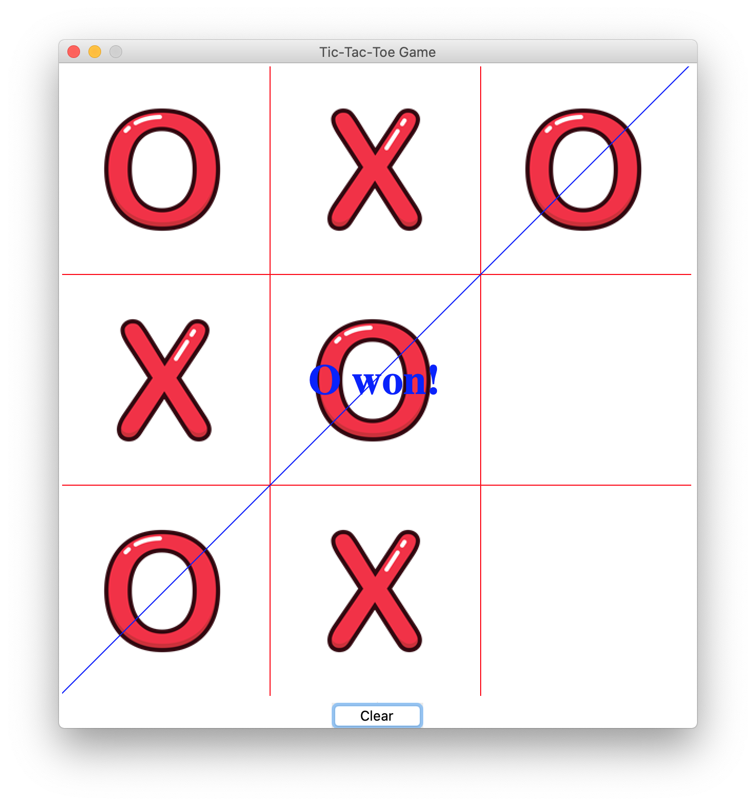
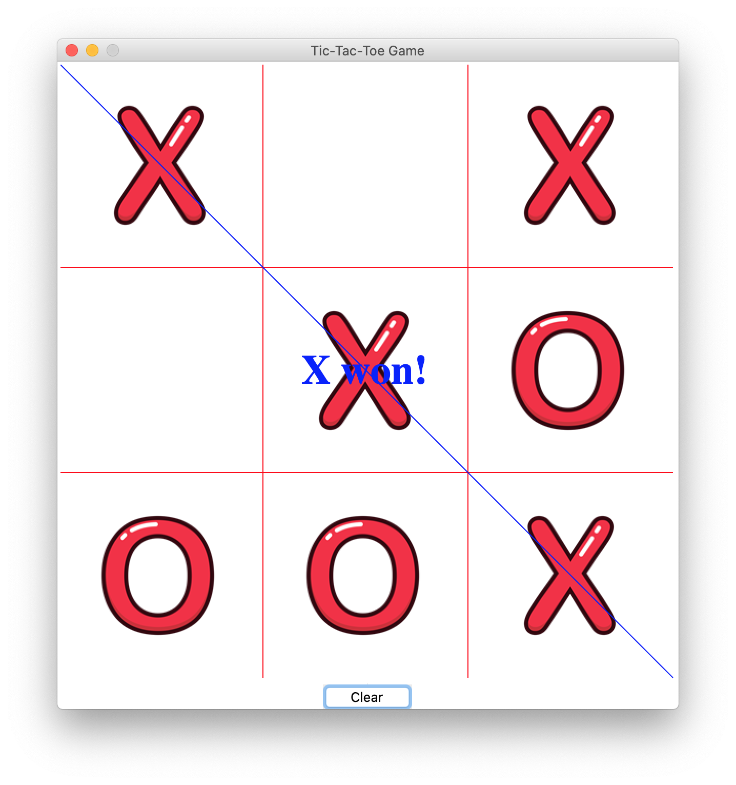
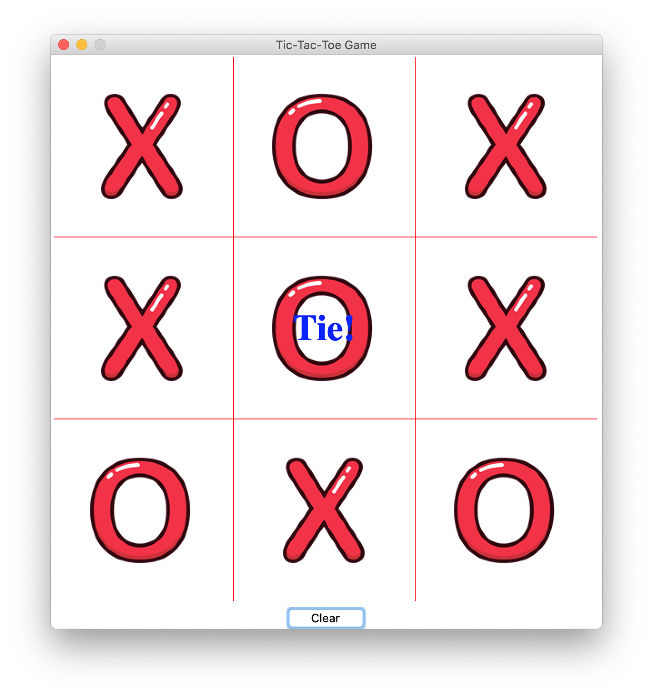

# Tic Tac Toe GAME Using Python🔥🔥🔥.




## This is a Multiplayer Tic Tac Toe Game.

#### The modules Used to make this Game are:-

        -Tkinter
        -Numpy

    This is a GUI based Multiplayer Game.

## Install
```
- Download this repository on local machine.
- Extract tic_tac_toe repository on local machine and open tic_tac_toe folder
- Double click on "Notepad -0.01-amd64.msi" To install Application.
- Give required permissions and Enjoy the tic_tac_toe Application.

```

Python Code On windows machine:

clone tic_tac_toe.py repository on local machine.
```

> git clone https://github.com/geosaleh/tic_tac_toe

```
change directory to tic_tac_toe.py
```

> cd tic_tac_toe/

```

Now its time to execute **tic_tac_toe.py**
```

> python tic_tac_toe.py

```
it will show following Output


## Download
:paperclip: [Download Here](https://github.com/geosaleh/tic_tac_toe)

Hope you'll install it in your computer just to try .


## Contributors
[deepraj02](https://github.com/deepraj02)


### Functionality to be added undo and redo to add more flexibility to it.
```
